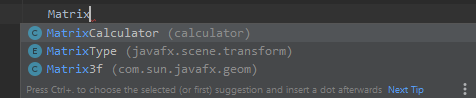
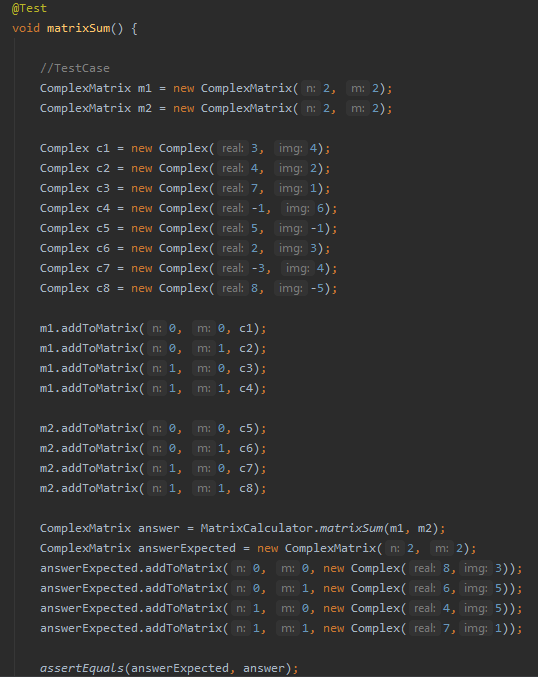
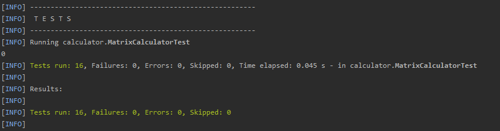

# MatrixComplexCalculator - LAB2 CNYT

Calculadora capaz de realizar gran cantidad de operaciones sobre matrices de números complejos.

## Para empezar

Estas instrucciones le proporcionarán una copia del proyecto en funcionamiento en su máquina local para fines de desarrollo y pruebas.

### Prerrequisitos

Qué cosas necesitas para instalar el Software:

- Maven
- Java 8+


### Instalando y corriendo

A continuación veras los pasos a seguir para la instalación del software

1. Clona el proyecto en tu maquina.

```
git clone https://github.com/SebastianGoenaga/MatrixComplexCalculator

```

2. Entra al directorio recién clonado.

3. Ejecuta los siguientes comandos:
	- Compila nuestro código. De los .java genera los .class.  
    `mvn compile`
	-   Compila las pruebas.  
    `mvn test-compile`
	-   Ejecuta las pruebas.  
    `mvn test`

### Cómo usar la libreria
1. Copie las siguientes etiquetas en su archivo pom.xml:

~~~
<repositories>
    <repository>
        <id>jitpack.io</id>
        <url>https://jitpack.io</url>
    </repository>
</repositories>

<dependencies>
    <dependency>
        <groupId>com.github.SebastianGoenaga</groupId>
 	        <artifactId>MatrixComplexCalculator</artifactId>
        <version>4148520034</version>
    </dependency>
</dependencies>
~~~

2. A continución ya debería ser capaz de usar la librería completa como se muestra en la siguiente imagen de ejemplo.


3. Recuerde acceder a la librería de forma estática.  

### Ingresar casos de prueba
El siguiente archivo es el que tendrá que modificar si quiere probar otros casos.
`\MatrixComplexCalculator\src\test\java\calculator\MatrixCalculatorTest.java`

En el caso `de matrixSum` debes modificar los complejos y las matrices a sumar que están indicados por el comentario `//TestCase`, y luego modificar la variable `answareExpected` que es la matriz esperada.


Del mismo modo es posible modificar cualquier caso de prueba para corroborar la efectividad del programa.

El resultado al finalizar y ejecutar nuevamente los comandos anteriormente indicados para ejecutar las pruebas, el resultado deberá ser el siguiente:




## Authors

-   **Sebastián Goenaga**  -  _Initial work_  -  [MatrixComplexCalculator](https://github.com/SebastianGoenaga/MatrixCopmplexCalculator)

## License

This project is licensed under the MIT License - see the  [LICENSE.md](https://github.com/SebastianGoenaga/MatrixCopmplexCalculator/blob/master/LICENSE)  file for details